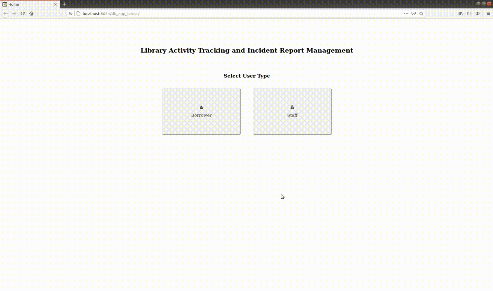

# library-transactions
A database application with distinct views for borrowers and faculty that keeps track of book borrowing transactions, incident reports, and the current stock of books in a library.

## My Contributions

- Full Stack Development (SQL/Database Management, Frontend, Backend)

## Collaborators

This project was developed in collaboration with:
- **Pierce Zachary**
- **Paula Rebeneque**
- **Rashde Sy**

## Features

- Track book borrowing transactions
- Manage incident reports
- Monitor current stock of books

## Tech Stack

- **Frontend**: JSP, HTML, CSS
- **Backend**: JSP, Servlets
- **Database**: MySQL
- **IDE**: NetBeans

## Project Setup

1. **Clone the repository**:
    ```bash
    git clone https://github.com/your-username/library-transactions.git
    cd library-transactions
    ```
2. **Open the project in NetBeans**:
    - Open NetBeans and select "Open Project..."
    - Navigate to the cloned repository and open the project

3. **Install necessary plugins**:
    - Ensure that all required NetBeans plugins are installed.
    - Note: The specific plugins were provided in a virtual machine by the professor, so they are not explicitly listed here.

4. **Set up the database**:
    - Import the SQL schema provided in the repository to your MySQL server.
    - Configure the database connection in the project settings.

5. **Run the project**:
    - Build and deploy the project on your local server.
    - Access the application through your web browser.

## Demo




## Contact
For any inquiries, feel free to reach out to:
- Simone Franceska Emanuelle M. Capio - simone\_franceska\_capio@dlsu.edu.ph
